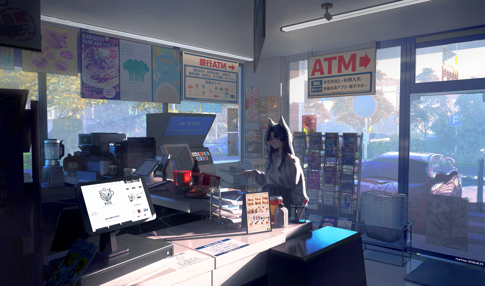

# SDDM Rice Setup — Material You (`ii-pixel`) + Wayland Greeter

A modern, Material You (Material 3) expressive SDDM login theme paired with a Wayland compositor (`niri`) greeter setup.



---

## 🎨 Overview

This SDDM rice configuration uses:
- **Theme**: `ii-pixel` (`themes/ii-pixel/`)
  - Material 3 dynamic color styling and smooth rounded polygon geometry.
  - Interactive password field with animated Material shape morphing characters.
  - Floating avatar card, battery indicator (reads `/sys/class/power_supply`), network and power buttons.
  - On-screen virtual keyboard (`VirtualKeyboard.qml`).
  - Google Material Symbols rounded icon typography (`MaterialSymbolsRounded.ttf`).
- **Wayland Greeter Compositor**: `niri` (`greeter/niri-greeter.kdl`)
  - Runs SDDM entirely on native Wayland without Xorg.
  - Resolves multi-screen and hybrid GPU issues on Wayland laptops.
  - Fullscreen borderless window rules with gaps and animations disabled for an instantaneous, flicker-free lock/login screen.
- **SDDM Drop-in Configurations**: (`conf.d/`)
  - `10-impasto.conf`: Sets `GreeterEnvironment=QML_XHR_ALLOW_FILE_READ=1` (enabling local XMLHttpRequests for battery monitoring) and faces path.
  - `98-inir-greeter.conf`: Sets `DisplayServer=wayland` and directs compositor to `/usr/share/inir/sddm/niri-greeter.kdl`.
  - `99-inir-theme.conf`: Activates `Current=ii-pixel`.

---

## 📦 Dependencies

On Arch Linux:
```bash
sudo pacman -S sddm niri qt6-declarative qt6-5compat qt6-svg qt6-multimedia
```

---

## 🚀 Installation

### Automated Install

Run the included installer:
```bash
cd sddm
chmod +x install.sh
sudo ./install.sh
```

### Manual Install

1. **Install Theme**:
   ```bash
   sudo mkdir -p /usr/share/sddm/themes
   sudo cp -r themes/ii-pixel /usr/share/sddm/themes/
   ```

2. **Install Greeter Compositor Config**:
   ```bash
   sudo mkdir -p /usr/share/inir/sddm
   sudo cp greeter/niri-greeter.kdl /usr/share/inir/sddm/
   ```

3. **Install SDDM Drop-in Configs**:
   ```bash
   sudo mkdir -p /etc/sddm.conf.d
   sudo cp conf.d/*.conf /etc/sddm.conf.d/
   ```

4. **Enable SDDM**:
   ```bash
   sudo systemctl enable sddm
   ```

---

## 🧪 Testing the Greeter

You can test the greeter in a windowed sandbox without logging out or rebooting:

```bash
# Test the installed system theme
sddm-greeter-qt6 --test-mode --theme /usr/share/sddm/themes/ii-pixel

# Or test directly from this repository folder
sddm-greeter-qt6 --test-mode --theme ./themes/ii-pixel
```

---

## ⚙️ Customization

### Background Image
Replace or edit:
```
themes/ii-pixel/assets/background.png
```
Or update `background` in `themes/ii-pixel/theme.conf`.

### Colors & Options
In `themes/ii-pixel/theme.conf`:
```ini
[General]
background=assets/background.png
blurRadius=50
primaryColor=#BAC5EE
onPrimaryColor=#333F61
surfaceColor=#0D0E12
surfaceContainerColor=#121318
onSurfaceColor=#E4E5F0
onSurfaceVariantColor=#83848E
backgroundColor=#0D0E12
errorColor=#FA746F
materialShapeChars=true
```
